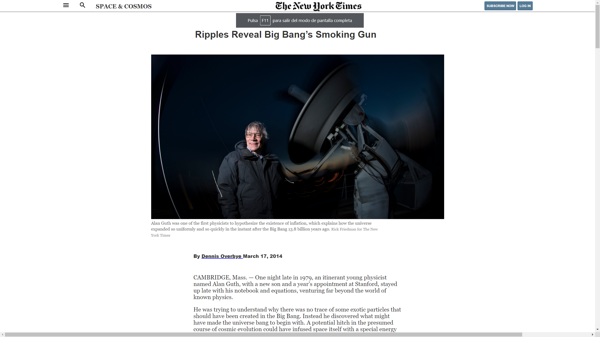

# Project 1: Positioning and floating elements

> This assignment consists of making a clone of a New York Times article page.

Article page of NYT

## Built With

- HTML&CSS

## Live Demo

[Live Demo Link](https://sjcco.github.io/Project-1-Positioning-and-Floating-Elements/)

## Authors

👤 **Author1**

- GitHub: [@sjcco](https://github.com/sjcco)
- Twitter:[@CarlosCamposO](https://twitter.com/CarlosCamposO)

## 🤝 Contributing

Contributions, issues, and feature requests are welcome!

Feel free to check the [issues page](issues/).

## Show your support

Give a ⭐️ if you like this project!

## Acknowledgments

- microverse team

## 📝 License

This project is [MIT](lic.url) licensed.
